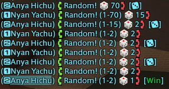

# ChatDeathRoll

Provides roll buttons in chat for death rolling and display results.

Installable using my custom repository (https://github.com/anya-hichu/DalamudPluginRepo) or from compiled archives.

## Screenshots

### Random
#### Player 1

#### Player 2

### Dice
#### Player 1

#### Player 2

### Config

## Commands

- `/chatdeathroll config`
- `/chatdeathroll enable`
- `/chatdeathroll disable`
